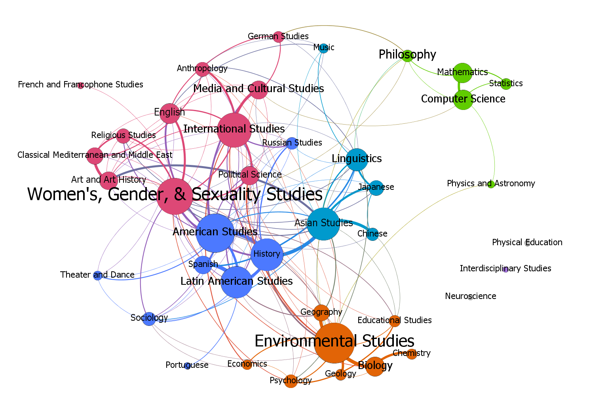

# Mapping Macalester's Majors

## Introduction

---

One of the defining characteristics of a liberal arts curriculum is the emphasis in taking classes from a variety of subjects. At Macalester College, some courses are cross-listed between disciplines to show they draw on material from multiple departments, and students are known to juggle multiple majors and minors. These connections and interrelations between subjects provide a prime opportunity to study them through a network science perspective. Network science allows us to understand these invisible links between subjects in new ways. I think we all have a general idea of what disciplines are related to one another -- like how Political Science and International Studies go together, or how Biology and Environmental Studies go together -- but this is all just an abstract idea inside our heads. By creating a network of these relationships, we turn this mapping into something concrete and exact. Thus in building this network, what we are really doing is visualizing the abstract. 
 
 In the following analysis we will examine the areas of study at Macalester through two separate networks: 1) a network of cross-listed courses over a four semester period from fall 2018 to spring 2020, and 2) a network of double majors/minors/concentrations using data from the class of 2020. The advantage of using these two types of networks is that we get a sense of the department versus student perspective on connections between disciplines. What cross-listed opportunities do departments offer to students? And where do student interests truly lie? By examining these two distinct views, hopefully we can see how interdisciplinary Macalester really is, and whether it lives up to its liberal arts ideology.


## Network Model

---

In this section I will discuss the details of what vertices and edges signify in the two types of networks. In both networks each vertex represents an area of study, but the vertices are slightly different in either network because there is not an exact correspondence between the prefixes listed on the class schedule and the degree areas offered at Macalester. For instance, although there is a data science minor, there is no designated prefix for data science courses. Moreover, information on concentrations does not appear on the class schedule. The following outlines the two types of network models:

1. **Network of cross-listed courses from fall 2018 to spring 2020**
    - vertices: areas of study listed on the class schedule
    - edges: a cross-listed course
    - edge weights: (three varieties) the number of cross-listed courses, the number of cross-listed sections, and enrollment in cross-listed courses

    I choose the timeframe of fall 2018 to spring 2020 for several reasons. For one, since I was comparing this network to the graduating class of 2020 it made sense for the final semester to be spring 2020. I did a two year (or four semester) period because classes are often rotated within departments and offered every other semester or every other year. This also gives us a larger sample size of classes.

2. **Network of double majors/minors/concentrations from the class of 2020**
    - vertices: areas of study listed for degrees
    - edges: a combination of two areas which a student earned a degree in
    - edge weight: calculated using the following formula
    
    ```
    edge_weight = 1 * (# of double majors) + 0.5 * (all other combinations) 
    ```

    Thus a double major would contribute an edge weight of 1, whereas a double minor or a major and a concentration for instance would contribute an edge weight of 0.5. I choose this weighting schema so that it would favor majors a little bit more since majors have more requirements, and I figured that minors and concentrations should be roughly equivalent. 

## Methodology

---

#### Cross-listed network

To gather data on cross-listed courses at Macalester I scraped course information from the registrar's [class schedule](https://www.macalester.edu/registrar/schedules/2020fall/class-schedule/). In order to do this, I used the [Beautiful Soup](https://www.crummy.com/software/BeautifulSoup/bs4/doc/) web scraping library in Python and made extensive use of regular expressions, which is a syntax for specifying text patterns. The scraper works by searching for the string "cross-listed" within the whole class schedule, and for each match we get the course title, course number, enrollment, and what courses it's cross-listed with. To keep track of what courses we'd already seen, the data was organized in a Python dictionary where the keys were the course's name and the values were information about the course. This worked fairly well except in cases were the course names were slightly off between cross-listed courses. I resolved this by creating another dictionary of cross-listed numbers seen so far, and if a course number was previously mentioned that course got skipped. To generate the edges in the network, I got the list of prefixes for each course and for each combination of two prefixes I wrote an edge between those two subjects.

#### Graduates network

The network of double majors/minors/concentrations was created using text from a PDF of the 2020 Macalester Commencement Program. For each graduate the first line listed their name, the second line listed their hometown, and the third line listed their degrees. Because Macalester students love having degrees in multiple subjects, sometimes this third line would span multiple lines. This posed a problem since I couldn't reliably discern when one line was the continuation of a previous line or if it was a new person. To address this, I used a nifty little regular expression which found consecutive lines that mentioned the word "major", "minor", or "concentration" and combined those lines into one line. Then I generated the edges for the network by going through each line with degree information and for each combination of two subjects I made an edge connecting those two areas using the previously mentioned formula for edge weight.


## Results

---

#### Cross-listed network

We'll start our analysis by looking at the networks of cross-listed courses. Keep in mind that the three variations differ only in their edge weight so the graph structure among all of them is the same. Let's begin with the simplest case where edge weights represent the number of cross-listed courses.



The resulting network has one giant connected component with 37 vertices and three disconnected vertices: Physical Education, Interdisciplinary Studies, and Neuroscience. It might seem strange that "Interdisciplinary Studies" was not cross-listed with any discipline, but this is because there are usually 2-3 courses taught each semester and they tend to be either seminars for fellowships or 1-2 credit courses. Similarly, Neuroscience only offers about 1-2 course sections each semester are for the Neuroscience Capstone.

**Degrees and Communities** - In this network the edges with the highest weight are between American Studies & History and Spanish & Latin American Studies, both with an edge weight of 13. This means that there were a total of 13 courses cross-listed between these two categories over a four semester period. The vertices with the highest weighted degree are American Studies (66); Environmental Studies (61); and Women's, Gender, and Sexuality Studies (57); with the weighted degree corresponding to the number of times courses in those subjects were cross-listed with other subjects. If we run a community detection algorithm on the graph, we get back back five communities of roughly equal size (12.5% - 27.5%). The two smallest ones both contain fives nodes and correspond to the green and cyan communities depicted above. Here is my take on the communities:
  
<li style="color: limegreen">green: the MSCS department plus closely related subjects (Physics and Philosophy)</li>
<li style="color: deepskyblue">light blue: Linguistics, Music, and subject related to Asia </li>
<li style="color: darkorange">orange: combination of natural sciences and social sciences (Geography, Economics, Psychology)
</li>
<li style="color: dodgerblue">dark blue: humanities with sociology (if we count foreign languages as humanities and Theatre and Dance as an art under humanities)</li>
<li style="color: deeppink">magenta: a mixture of humanities (English, Religious Studies, Art) and social sciences (International Studies, Political Science)
</li>

**Eigenvector Centrality** - If we were interested in finding the "most interdisciplinary" subject, the weighted degrees for each area of study tell us how often that subject was cross-listed. However, if we really want a thorough understanding of what subject is the most interdisciplinary, we must also take into account how interdisciplinary the neighbor disciplines are. The best-suited measure for finding this is the eigenvector centralities of the vertices. The three highest eigenvector centralities belong to Women's, Gender, and Sexuality Studies (1.0); International Studies (0.965); and American Studies(0.954). Let's examine the eigenvectors centralities alongside weighted degrees:


Two subjects, Linguistics and Sociology, launched to the top of the eigenvector centralities despite their low degree, so we get the sense that the disciplines they are connected with are very well-connected. On the otherhand, History really dropped down in eigenvector centrality.

**PageRank** -
Another centrality measure we can investigate are the PageRank centralities of nodes. The vertices with the highest PageRank centralities are Environmental Studies (0.068); American Studies (0.065); and Women's, Gender, and Sexuality Studies (0.061) The PageRank centrality measures can be interpreted as follows. Suppose we start with a random department on the class schedule page. With a probability of 0.85 we pick one of the mentioned cross-listed sections within that department and follow it to a new department, and with a probability of 0.15 we pick a department at random. Then the PageRank centralities are the long-run probabilites that we end up on a given subject. If we return back to the picture of the network, it's clear why Environmental Studies jumped to the top. The disciplines Environmental Studies is connected with have low degreees, such as Psychology, Geology, Biology, and Physics. Therefore, from these vertices we have few choices as to where we go next, so with high probability we end up at Environmental Studies. We can see that the PageRank for WGSS suffered for the opposite reason: because WGSS has a high eigenvector centrality and is connected to many high-degree vertices, few links led back to it.